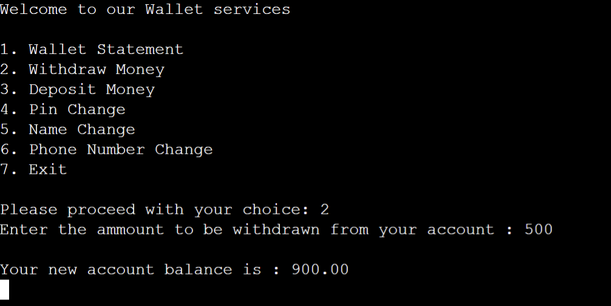

# VIRTUAL WALLET

  

Welcome to your Virtual Wallet! This project is a simple command-line application that allows users to manage their virtual wallet accounts, perform transactions, and update their account information.

 
 

## Features

- User login: Users can log in to their existing accounts or create new ones.
- Account management: Users can view their account balance and transaction history.
- Transactions: Users can deposit or withdraw money from their accounts.
- Account customization: Users can change their PIN, username, and phone number.
- Admin login: Administrators can log in to view and manage user accounts.

 
 

## Screenshots

 

- ### Startup Menu

&nbsp;&nbsp;&nbsp;&nbsp;&nbsp;&nbsp;&nbsp;&nbsp;&nbsp;&nbsp;&nbsp;&nbsp; 

 

- ### User Login

&nbsp;&nbsp;&nbsp;&nbsp;&nbsp;&nbsp;&nbsp;&nbsp;&nbsp;&nbsp;&nbsp;&nbsp; 

 

- ### Account Creation

&nbsp;&nbsp;&nbsp;&nbsp;&nbsp;&nbsp;&nbsp;&nbsp;&nbsp;&nbsp;&nbsp;&nbsp; 

 

- ### User Services

&nbsp;&nbsp;&nbsp;&nbsp;&nbsp;&nbsp;&nbsp;&nbsp;&nbsp;&nbsp;&nbsp;&nbsp; 

 

- ### Account Statement

&nbsp;&nbsp;&nbsp;&nbsp;&nbsp;&nbsp;&nbsp;&nbsp;&nbsp;&nbsp;&nbsp;&nbsp; 

 

- ### Cash Withdrawal

&nbsp;&nbsp;&nbsp;&nbsp;&nbsp;&nbsp;&nbsp;&nbsp;&nbsp;&nbsp;&nbsp;&nbsp; 

 

- ### Cash Deposit

&nbsp;&nbsp;&nbsp;&nbsp;&nbsp;&nbsp;&nbsp;&nbsp;&nbsp;&nbsp;&nbsp;&nbsp; 

 

- ### PIN Change

&nbsp;&nbsp;&nbsp;&nbsp;&nbsp;&nbsp;&nbsp;&nbsp;&nbsp;&nbsp;&nbsp;&nbsp; 

 

- ### Admin Access

&nbsp;&nbsp;&nbsp;&nbsp;&nbsp;&nbsp;&nbsp;&nbsp;&nbsp;&nbsp;&nbsp;&nbsp; 

 
 

## Installation

1. Clone the repository: `git clone https://github.com/your-username/your-virtual-wallet.git`
2. Navigate to the project directory: `cd your-virtual-wallet`
3. Compile the source code: `gcc -o virtual_wallet virtual_wallet.c`
4. Run the application: `./virtual_wallet`

 
 

## Dependencies

- Standard C libraries: `stdio.h`, `string.h`, `stdlib.h`
- Console input/output library: `conio.h`

 
 

## Usage

1. Upon launching the application, you will be greeted with the login screen.
2. Choose the appropriate option:
   - **Log In**: Enter your username and PIN to access your account.
   - **New User Account**: Create a new account by providing your details.
   - **Admin Login**: Log in as an admin to perform administrative tasks.
3. Once logged in, you can select various services from the menu:
   - **Wallet Statement**: View your account statement and balance.
   - **Withdraw Money**: Withdraw cash from your account.
   - **Deposit Money**: Deposit cash into your account.
   - **Pin Change**: Change your PIN for added security.
   - **Name Change**: Update your username.
   - **Phone Number Change**: Change your phone number.
   - **Exit**: Exit the application.
4. Enjoy managing your finances with Your Virtual Wallet!

 
 

## License

This project is licensed under the MIT License. See the `LICENSE` file for more information.
